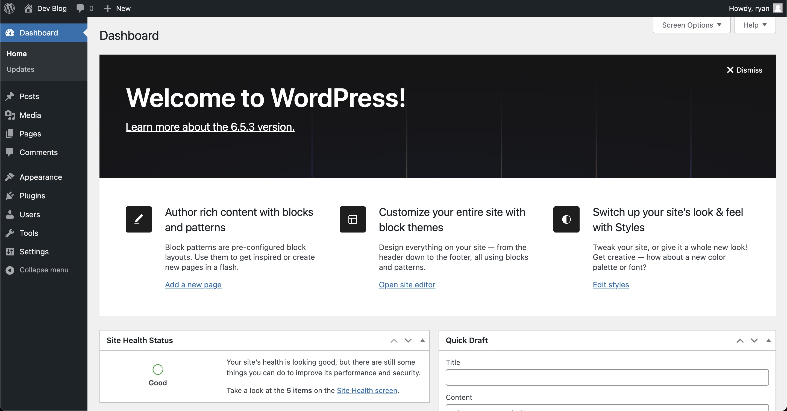

# Guide on How to Use a CMS (Content Management System)

## Why use a CMS?
A CMS allows the owner or developer of a website to develop their website efficiently and with ease. CMS's provide user-friendly ways of setting up websites, such as setting up themes, ease of uploading blog posts, etc. Also, CMS's allow for the use of many plugins that can make setting up a website even easier.

## Installing Wordpress
First, you will need to download the CMS from the website. For this guide, we will be using Wordpress as it is one of the most popular CMS's out there. To download Wordpress, go to their website [https://developer.wordpress.org/advanced-administration/before-install/howto-install/] and follow the 5 minute setup

## Features of Wordpress
After Wordpress is installed, you have access to many features, including
  * Themes
  * Creating Content

Before you are able to do these things, you must first set up an admin account. After that is done, you can access the admin page by going to [yourwebsite]/wp-admin. This is what the admin page should look like. You can see all the navbar elements

## Setting up themes
In your wordpress dashboard, you can change the theme of your website by going to
    Appearance -> Themes
Then click on "Add New" and browse the theme.
After you pick a theme you enjoy, you can then install it, then click activate

## Creating Content
Creating content on Wordpress allows you to pubish images, posts, etc.
To get started, navigate to 
    Posts -> Add New
This will allow you to upload posts, images, and more!

## Adding a new Page
Go to Pages -> New
Similar to adding a post, enter content and media.
Then click on Publish for your new page!